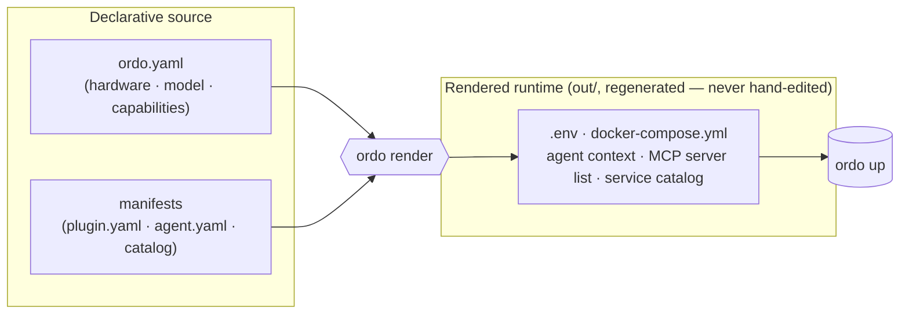
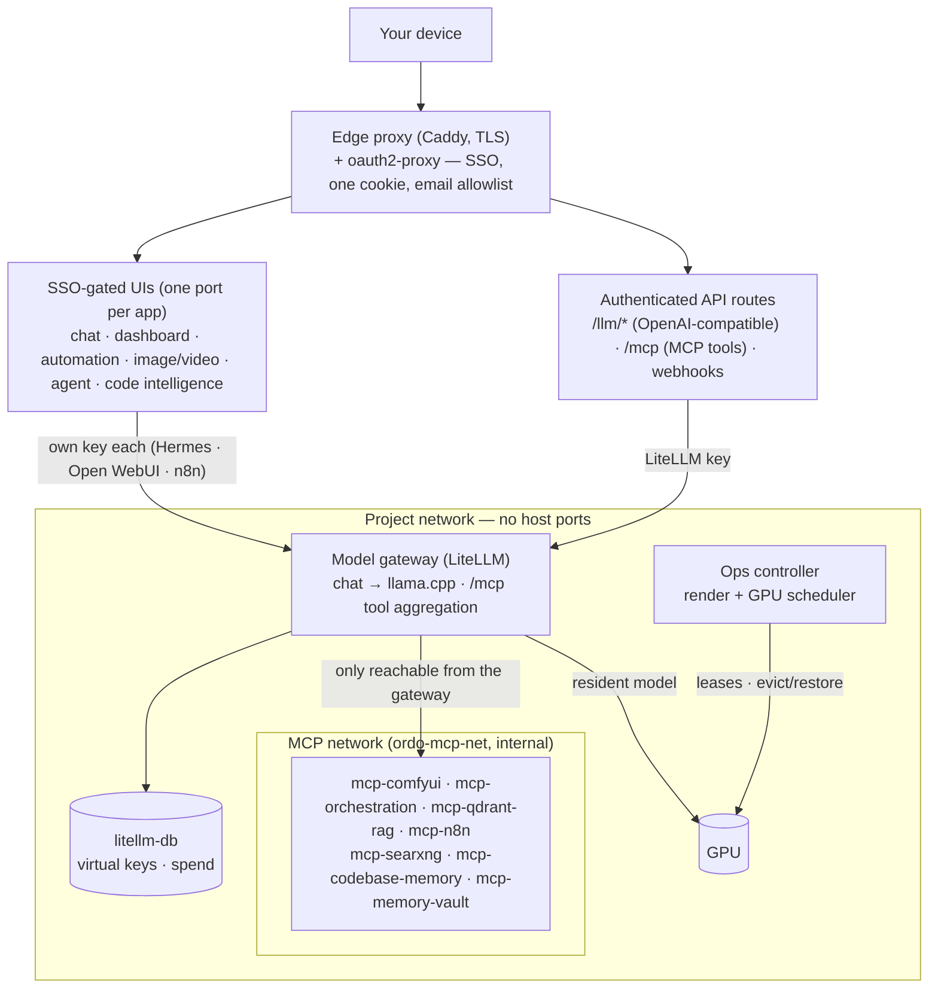

```
  ___          _
 / _ \ _ __ __| | ___
| | | | '__/ _` |/ _ \
| |_| | | | (_| | (_) |
 \___/|_|  \__,_|\___/

──────────────────────────────────────────────────
Local-first AI homelab: stand up services from a one-line manifest, then let them intelligently share one GPU — one declarative source, one scheduler, one dashboard.
```

**Ordo** is a local-first, single-operator AI homelab built around two ideas:

**1 · Services are cheap to add.** Every service, MCP tool, and agent is a declarative **manifest**, not hand-written plumbing. Drop a `plugin.yaml` (or `agent.yaml` / `catalog.json`) in, and `ordo render` composes it into the running stack — network wiring, front-door route, dashboard card, health check, and dependencies included. Adding a capability is an edit to one source file, not a compose-surgery session.

**2 · Services intelligently share one GPU.** A homelab has one expensive card and many things that want it — a resident chat model, image/video diffusion, 3D, voice. Ordo runs a real **scheduler** (`ordo serve`) that arbitrates GPU *residency*: the chat model stays resident and co-runs when a job fits, or is cleanly evicted and **restored** when a big render needs the whole card. Every GPU service *declares* how it competes (`gpu_arbitration:` — resident, burst, or exempt), and for work that can't ask politely — a render hand-queued in a web UI — an admission **gate** forces the request through the scheduler before it can touch the card. Two tenants never silently saturate the GPU (the failure that hard-crashed the box before the gate existed).

Everything else follows from those two. The stack runs llama.cpp models behind an **OpenAI-compatible** LiteLLM gateway, **Open WebUI** for chat, **ComfyUI** for image/video diffusion, **n8n** for automation, and that same gateway's **MCP endpoint** (`/mcp`) for shared tools — all fronted by one **dashboard** and reached through a single **SSO front door** (Caddy + oauth2-proxy). Every choice is made once — in an **interactive terminal wizard** — and captured in one declarative source (`ordo.yaml`) that renders into the running config. Derived files are regenerated, never hand-edited, so configuration drift is structurally impossible.

## Install

One command takes a fresh machine from nothing to a configured stack — it installs the `ordo` CLI and drops you straight into the interactive setup wizard, **in the same terminal**. Open your normal terminal and run the line for your platform:

**macOS / Linux** (bash · zsh · or Git Bash on Windows):

```bash
curl -fsSL https://raw.githubusercontent.com/AlienWalker1995/Ordo-AI-Stack/main/install.sh | sh
```

```bash
# no curl? use wget:
wget -qO- https://raw.githubusercontent.com/AlienWalker1995/Ordo-AI-Stack/main/install.sh | sh
```

**Windows** (PowerShell):

```powershell
irm https://raw.githubusercontent.com/AlienWalker1995/Ordo-AI-Stack/main/install.ps1 | iex
```

> The Windows line must run in **PowerShell**, not `cmd`. (`curl … | sh` only works inside a POSIX shell — Git Bash or WSL — so on native Windows use the PowerShell one-liner.)

Either path checks prerequisites (git, Docker + `docker compose` v2, Python 3.11+; warns if there's no NVIDIA GPU), clones the repo (`~/ordo`, or `%USERPROFILE%\ordo` on Windows; override with the `ORDO_DIR` env var), installs the CLI into a virtualenv, and launches the wizard.

### Quickstart: local only, no accounts

`ordo init` asks three questions, each with a default (press **Enter**):

1. **Model**: the best fit for the detected hardware, or pick another.
2. **Features**: chat only, chat + tools, or everything this hardware supports (default).
3. **Start now?**: renders the config, checks this host (`ordo preflight`), and runs `ordo up --all`.

It writes `out/ordo.yaml` and `out/secrets.env` (internal secrets generated, never committed) and prints the model and plugins it chose. The UIs listen on this machine only:

| UI | URL |
|---|---|
| Chat (Open WebUI) | http://127.0.0.1:8443 |
| Dashboard | http://127.0.0.1:8444 |

Later, by hand: `ordo up --all` (it runs the host checks first; `--no-preflight` skips them). It downloads the chat model into its volume on a first run, checksum-verified ([Model Pull](docs/data.md#model-pull)).

### Remote access (optional, later)

```bash
ordo remote enable     # Tailscale hostname, bind address, Google OAuth client, allowlisted emails
ordo up --all
```

Caddy then becomes the one front door (HTTPS on your tailnet, Google sign-in) and the loopback ports close. `ordo remote disable` reverses it. Details: [auth runbook](docs/runbooks/auth.md).

## Overview

**Deployment model:** a single operator running the stack on their own hardware. Out of the box the chat UI and dashboard listen on `127.0.0.1` only; with remote access on (`ordo remote enable`) the stack is reached through one authenticated front door and only the edge proxy publishes host ports: every UI sits behind SSO, and one sign-in (a domain-scoped cookie) covers the whole stack, gated by an email allowlist you control. Internal services (model gateway, the MCP servers behind it, vector store) publish no host ports and are reachable only on the project network, or through the front door's authenticated API routes. The concrete port layout lives in the [operator guide](docs/operator-guide.md) and the [auth runbook](docs/runbooks/auth.md).

**Who it is for:** anyone who wants to run local AI models on their own machine and reach them securely from their own devices — with configuration discipline built in rather than bolted on.

## How it works

Ordo is driven by a render engine, not by hand-edited compose files:



- **One source of truth** — `ordo.yaml` declares hardware, model, plugins, and overrides.
- **`ordo render`** turns that source (+ detected hardware + model catalog + plugin/agent/service manifests) into the complete runtime config under `out/` (gitignored). Services run from the rendered output; to change anything, edit the source and re-render. Edits to derived files never survive, so model choice, context sizes, and agent config can never fall out of sync.
- **Core #1 — a service is a manifest.** A service, MCP server, or agent is a declarative manifest the renderer composes in when its hardware needs are met — it brings its own compose block, front-door route, dashboard card, health check, and GPU declaration. Adding one is a file, not a code change. See [`docs/agents.md`](docs/agents.md).
- **Core #2 — compute-sharing is a scheduler with teeth** (`ordo serve`, the `ops-controller` service): FIFO admission, co-run-when-it-fits, **evict-and-restore** the resident model for a big job, LRU idle-evict — a deterministic decision engine, not a reactive watchdog. Each GPU service *declares* its arbitration (`gpu_arbitration:` — mode `resident`/`burst`/`exempt` × enforcement `broker`/`client`/`gate`/`none`). Queue-driven services that can't self-arbitrate sit behind an admission **gate** that acquires a lease before forwarding a submission, so nothing bypasses the scheduler and co-saturates the card.

Full engine reference, the plugin/agent registries, and the render-discipline runbook are in [`docs/operator-guide.md`](docs/operator-guide.md).

## Features

Every UI is published only through the SSO front door; APIs are exposed on authenticated front-door routes (`/llm/*`, `/mcp`). What the stack gives you:

- **Chat** — Open WebUI backed by an **OpenAI-compatible model gateway** (LiteLLM in front of llama.cpp), so any OpenAI-style client works against your local models.
- **Image & video** — ComfyUI workflows with scheduler-gated GPU access; large models download on demand.
- **Automation** — n8n, with webhook and OAuth passthrough at the front door.
- **Agents** — a pluggable agent framework (`agent.yaml` manifests) with an included default assistant (Hermes): chat through the model gateway, tools through that gateway's `/mcp` endpoint, GPU through the scheduler.
- **Shared tools** — MCP servers run as their own services on an internal network and are aggregated behind one `/mcp` URL on the model gateway, so host clients (Claude Code, editors) and in-stack services use the same endpoint and key.
- **Code intelligence** — a codebase-memory service that indexes your repositories into a queryable knowledge graph, with its own UI.
- **Unified dashboard**: five pages (Overview, Services, Models, Media, Performance) covering stack health, per-container actions and logs, one safe GPU model switch, ComfyUI renders and model files, and an embedded Grafana performance view; plus a Settings drawer and a Ctrl/Cmd K command palette.
- **Ops controller** — the render/scheduler control plane (internal, token-auth).
- **Agent tracing**: optional self-hosted [Langfuse](services/langfuse/README.md): every agent turn, LLM call and tool call as a searchable trace, plus datasets and evals, with unattended first-boot setup. Opt-in; the agent fails open when it is off or down.
- **Optional, hardware-gated plugins** — voice (STT + TTS), RAG (Qdrant retrieval), and monitoring (Grafana + Prometheus + GPU exporter) enable when your hardware supports them.

## Security

- **Front door:** Caddy + oauth2-proxy gates every browser-reachable UI at the network edge. One sign-in covers the whole stack — no per-service re-auth. The email allowlist is operator-controlled (and never committed). See [docs/runbooks/auth.md](docs/runbooks/auth.md).
- **No host ports on services:** only the edge proxy publishes host ports; everything else lives on the project network.
- **Secret management:** SOPS + age. Only encrypted `secrets/*.sops` blobs and config are committed; plaintext is decrypted **on the host only**, outside every container's reach, and never enters the repo or a log. Never synthesize placeholder secret values to clear an error — decrypt on the host. Full notes: [SECURITY.md](SECURITY.md) · [docs/runbooks/secrets.md](docs/runbooks/secrets.md).

## Architecture



Local-first AI; operator-deployed front door. The dashboard does not mount `docker.sock`; the scheduler's process broker is hard-scoped to the stack's own containers. Details: [PRD index](docs/product%20requirements%20docs/index.md).

## Development & testing

- **Runtime:** everything runs in containers; install Docker and set `BASE_PATH` to the repo path.
- **Substrate:** the render engine is a real `ordo` command (`pip install -e .`; runtime dep = just PyYAML; `.[serve]` adds the control plane). Python **3.11+**.

```bash
# render-engine tests (no host Python needed)
docker run --rm -v "$PWD:/w" -w /w python:3.11-slim \
  sh -c "pip install -q -r requirements-dev.txt && PYTHONPATH=. python -m pytest -q tests/substrate"
```

CI ([`.github/workflows/ci.yml`](.github/workflows/ci.yml)): TruffleHog secret scan, pytest + ruff, and a real `docker compose config` gate on the rendered stack.

## Access & deployment models

The stack's UIs are served through a **swappable edge layer** — the same rendered compose stack
behind any of three front doors: a private **Tailscale tailnet** (the default), a
**self-hosted public domain**, or a **cloud VM**. All three keep the same SSO gate; the public
ones add exposure and hardening requirements. See [docs/deployment-models.md](docs/deployment-models.md).

## Docs

[Operator guide (`docs/operator-guide.md`)](docs/operator-guide.md) · [Access & deployment models](docs/deployment-models.md) · [Auth front door](docs/runbooks/auth.md) · [Secrets](docs/runbooks/secrets.md) · [Notes sync (Obsidian)](docs/runbooks/notes-sync.md) · [Data](docs/data.md) · [Hermes agent](docs/hermes-agent.md) · [PRD index](docs/product%20requirements%20docs/index.md) · [Contributing](CONTRIBUTING.md) · [Security policy](SECURITY.md)

## License

[MIT License](LICENSE) — Copyright (c) 2026 Ordo contributors.
