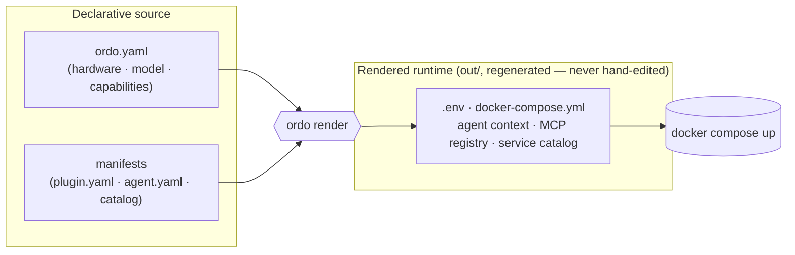
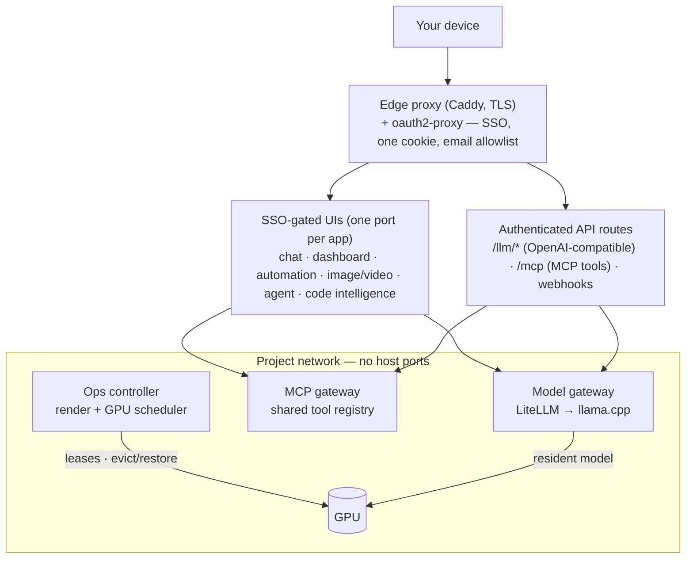

```
  ___          _
 / _ \ _ __ __| | ___
| | | | '__/ _` |/ _ \
| |_| | | | (_| | (_) |
 \___/|_|  \__,_|\___/

──────────────────────────────────────────────────
Local-first AI homelab: stand up services from a one-line manifest, then let them intelligently share one GPU — one declarative source, one scheduler, one dashboard.
```

**Ordo** is a local-first, single-operator AI homelab built around two ideas:

**1 · Services are cheap to add.** Every service, MCP tool, and agent is a declarative **manifest**, not hand-written plumbing. Drop a `plugin.yaml` (or `agent.yaml` / `catalog.json`) in, and `ordo render` composes it into the running stack — network wiring, front-door route, dashboard card, health check, and dependencies included. Adding a capability is an edit to one source file, not a compose-surgery session.

**2 · Services intelligently share one GPU.** A homelab has one expensive card and many things that want it — a resident chat model, image/video diffusion, 3D, voice. Ordo runs a real **scheduler** (`ordo serve`) that arbitrates GPU *residency*: the chat model stays resident and co-runs when a job fits, or is cleanly evicted and **restored** when a big render needs the whole card. Every GPU service *declares* how it competes (`gpu_arbitration:` — resident, burst, or exempt), and for work that can't ask politely — a render hand-queued in a web UI — an admission **gate** forces the request through the scheduler before it can touch the card. Two tenants never silently saturate the GPU (the failure that hard-crashed the box before the gate existed).

Everything else follows from those two. The stack runs llama.cpp models behind an **OpenAI-compatible** LiteLLM gateway, **Open WebUI** for chat, **ComfyUI** for image/video diffusion, **n8n** for automation, and an **MCP gateway** for shared tools — all fronted by one **dashboard** and reached through a single **SSO front door** (Caddy + oauth2-proxy). Every choice is made once — in an **interactive terminal wizard** — and captured in one declarative source (`ordo.yaml`) that renders into the running config. Derived files are regenerated, never hand-edited, so configuration drift is structurally impossible.

## Install

One command takes a fresh machine from nothing to a configured stack — it installs the `ordo` CLI and drops you straight into the interactive setup wizard, **in the same terminal**. Open your normal terminal and run the line for your platform:

**macOS / Linux** (bash · zsh · or Git Bash on Windows):

```bash
curl -fsSL https://raw.githubusercontent.com/AlienWalker1995/Ordo-AI-Stack/main/install.sh | sh
```

```bash
# no curl? use wget:
wget -qO- https://raw.githubusercontent.com/AlienWalker1995/Ordo-AI-Stack/main/install.sh | sh
```

**Windows** (PowerShell):

```powershell
irm https://raw.githubusercontent.com/AlienWalker1995/Ordo-AI-Stack/main/install.ps1 | iex
```

> The Windows line must run in **PowerShell**, not `cmd`. (`curl … | sh` only works inside a POSIX shell — Git Bash or WSL — so on native Windows use the PowerShell one-liner.)

Either path checks prerequisites (git, Docker + `docker compose` v2, Python 3.11+; warns if there's no NVIDIA GPU), clones the repo (`~/ordo`, or `%USERPROFILE%\ordo` on Windows — override with the `ORDO_DIR` env var), installs the CLI into a virtualenv, and launches the wizard. That's the only step — everything else is the wizard.

### The setup wizard — `ordo init`

The wizard **is** the configuration experience: every decision about your stack is made here, in the terminal, with a sensible default on each prompt (press **Enter** to accept it). Press **Ctrl-C** at any prompt to cancel — nothing is written until you review and confirm at the end.

1. **Hardware** — confirms the auto-detected GPU / RAM / CPU (or pin it later for reproducibility).
2. **Model** — accepts the best-fit pick from the catalog, or choose another by tier.
3. **Capabilities** — which optional groups to turn on (chat is always on): image/video, RAG, voice, automation (n8n), web search, monitoring, **notes sync** (cross-device Obsidian). Default is hardware-gated auto.
4. **Secure front door** — set up the SSO gate now (bring your own Tailscale tailnet and Google OAuth client), or skip it (with an explicit warning that the stack then runs unauthenticated). If you set it up, the hostname, OAuth client id/secret, and email allowlist are **required** — leave one blank and the wizard asks whether to defer it or re-enter, so you never ship a half-configured gate. It prints the exact Google console URL + callback and offers to provision a TLS cert.
5. **External tokens** — Hugging Face, Tailscale, and GitHub tokens; all optional (Enter to skip). Internal keys (LiteLLM, ops, MCP, cookie, SearXNG, n8n) are **auto-generated** for you.
6. **Review & confirm** — a summary of every choice (hardware, model, capabilities, front door, secrets) with a final **Y/n**. Decline and nothing is written.

On confirm it writes `out/ordo.yaml` and `out/secrets.env` (chmod 600, never committed), then **offers** to render the config, download the model, and bring the stack up — finishing with your dashboard URL. Nothing is started unless you say yes; a piped or `--yes` install only writes config and stops.

Re-run `ordo init` any time to reconfigure. **Prefer to drive the render engine by hand?** Skip the wizard and follow `ordo render` → `ordo preflight` → `docker compose up` in the **[operator guide](docs/operator-guide.md)**.

## Overview

**Deployment model:** a single operator running the stack on their own hardware, reached through one authenticated front door. Only the edge proxy publishes host ports — every UI sits behind SSO, and one sign-in (a domain-scoped cookie) covers the whole stack, gated by an email allowlist you control. Internal services (model gateway, MCP gateway, vector store) publish no host ports and are reachable only on the project network, or through the front door's authenticated API routes. The concrete port layout lives in the [operator guide](docs/operator-guide.md) and the [auth runbook](docs/runbooks/auth.md).

**Who it is for:** anyone who wants to run local AI models on their own machine and reach them securely from their own devices — with configuration discipline built in rather than bolted on.

## How it works

Ordo is driven by a render engine, not by hand-edited compose files:



- **One source of truth** — `ordo.yaml` declares hardware, model, plugins, and overrides.
- **`ordo render`** turns that source (+ detected hardware + model catalog + plugin/agent/service manifests) into the complete runtime config under `out/` (gitignored). Services run from the rendered output; to change anything, edit the source and re-render. Edits to derived files never survive, so model choice, context sizes, and agent config can never fall out of sync.
- **Core #1 — a service is a manifest.** A service, MCP server, or agent is a declarative manifest the renderer composes in when its hardware needs are met — it brings its own compose block, front-door route, dashboard card, health check, and GPU declaration. Adding one is a file, not a code change. See [`docs/agents.md`](docs/agents.md).
- **Core #2 — compute-sharing is a scheduler with teeth** (`ordo serve`, the `ops-controller` service): FIFO admission, co-run-when-it-fits, **evict-and-restore** the resident model for a big job, LRU idle-evict — a deterministic decision engine, not a reactive watchdog. Each GPU service *declares* its arbitration (`gpu_arbitration:` — mode `resident`/`burst`/`exempt` × enforcement `broker`/`client`/`gate`/`none`). Queue-driven services that can't self-arbitrate sit behind an admission **gate** that acquires a lease before forwarding a submission, so nothing bypasses the scheduler and co-saturates the card.

Full engine reference, the plugin/agent registries, and the render-discipline runbook are in [`docs/operator-guide.md`](docs/operator-guide.md).

## Features

Every UI is published only through the SSO front door; APIs are exposed on authenticated front-door routes (`/llm/*`, `/mcp`). What the stack gives you:

- **Chat** — Open WebUI backed by an **OpenAI-compatible model gateway** (LiteLLM in front of llama.cpp), so any OpenAI-style client works against your local models.
- **Image & video** — ComfyUI workflows with scheduler-gated GPU access; large models download on demand.
- **Automation** — n8n, with webhook and OAuth passthrough at the front door.
- **Agents** — a pluggable agent framework (`agent.yaml` manifests) with an included default assistant (Hermes): chat through the model gateway, tools through the MCP gateway, GPU through the scheduler.
- **Shared tools** — an MCP gateway serving one tool registry to host clients (Claude Code, editors) and in-stack services alike.
- **Code intelligence** — a codebase-memory service that indexes your repositories into a queryable knowledge graph, with its own UI.
- **Unified dashboard** — model lists, service links, dependency health, GPU and registry views, model pulls, and an embedded monitoring view.
- **Ops controller** — the render/scheduler control plane (internal, token-auth).
- **Optional, hardware-gated plugins** — voice (STT + TTS), RAG (Qdrant retrieval), and monitoring (Grafana + Prometheus + GPU exporter) enable when your hardware supports them.

## Security

- **Front door:** Caddy + oauth2-proxy gates every browser-reachable UI at the network edge. One sign-in covers the whole stack — no per-service re-auth. The email allowlist is operator-controlled (and never committed). See [docs/runbooks/auth.md](docs/runbooks/auth.md).
- **No host ports on services:** only the edge proxy publishes host ports; everything else lives on the project network.
- **Secret management:** SOPS + age. Only encrypted `secrets/*.sops` blobs and config are committed; plaintext is decrypted **on the host only**, outside every container's reach, and never enters the repo or a log. Never synthesize placeholder secret values to clear an error — decrypt on the host. Full notes: [SECURITY.md](SECURITY.md) · [docs/runbooks/secrets.md](docs/runbooks/secrets.md).

## Architecture



Local-first AI; operator-deployed front door. The dashboard does not mount `docker.sock`; the scheduler's process broker is hard-scoped to the stack's own containers. Details: [PRD index](docs/product%20requirements%20docs/index.md).

## Development & testing

- **Runtime:** everything runs in containers; install Docker and set `BASE_PATH` to the repo path.
- **Substrate:** the render engine is a real `ordo` command (`pip install .`; runtime dep = just PyYAML). Python **3.12+** for tests/lint.

```bash
# render-engine tests (no host Python needed)
docker run --rm -v "$PWD:/w" -w /w python:3.11-slim \
  sh -c "pip install -q -r requirements-dev.txt && PYTHONPATH=. python -m pytest -q tests/substrate"
```

CI ([`.github/workflows/ci.yml`](.github/workflows/ci.yml)): TruffleHog secret scan, pytest + ruff, and a real `docker compose config` gate on the rendered stack.

## Access & deployment models

The stack's UIs are served through a **swappable edge layer** — the same rendered compose stack
behind any of three front doors: a private **Tailscale tailnet** (the default), a
**self-hosted public domain**, or a **cloud VM**. All three keep the same SSO gate; the public
ones add exposure and hardening requirements. See [docs/deployment-models.md](docs/deployment-models.md).

## Docs

[Operator guide (`docs/operator-guide.md`)](docs/operator-guide.md) · [Access & deployment models](docs/deployment-models.md) · [Auth front door](docs/runbooks/auth.md) · [Secrets](docs/runbooks/secrets.md) · [Notes sync (Obsidian)](docs/runbooks/notes-sync.md) · [Data](docs/data.md) · [Hermes agent](docs/hermes-agent.md) · [PRD index](docs/product%20requirements%20docs/index.md) · [Contributing](CONTRIBUTING.md) · [Security policy](SECURITY.md)

## License

[MIT License](LICENSE) — Copyright (c) 2026 Ordo contributors.
